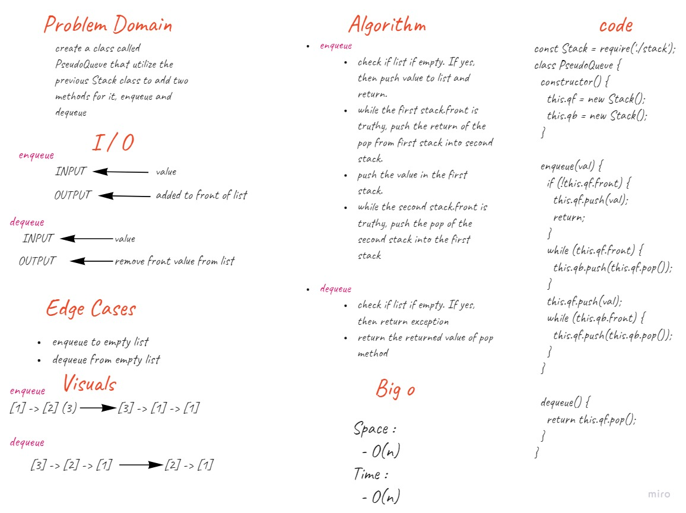

# Challenge Summary  
create a PseudoQueue class the is built from two stack instances, and mimic the functionality of Queue stack in two methods. Enqueue and Dequeue.  
## Whiteboard Process  
  

## Approach & Efficiency  

### Efficiency  
- Enqueue:  
  - time: O(n)
  - space: O(n)
- Dequeue:  
  - time: O(1)
  - space: O(1)

### Approach  
1. I understood the problem first.
1. I imagined how the results should be.
1. I made a drawings of how the `the list` would be after multiple `Enqueues`. 
1. I wrote the algorithm.
1. I wrote the code.
1. I made the tests.