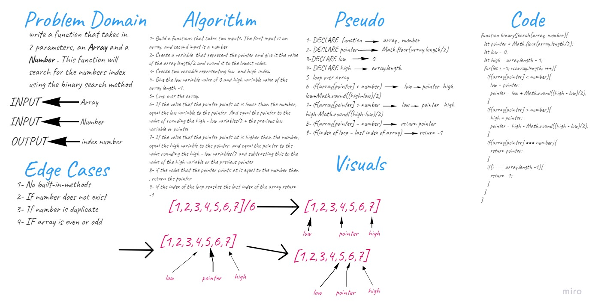

# Binary search in a sorted 1D array
Write a function called `BinarySearch` which takes in 2 parameters: a sorted array and the search key. Without utilizing any of the built-in methods available to your language, return the index of the array’s element that is equal to the value of the search key, or -1 if the element is not in the array.  

## Whiteboard Process  
  

## Approach & Efficiency
1. I first took my time to understand the problem.
1. I solved the challenge on a text editor.
1. I started drawing the white-board.
1. It took me 1 and a half hour to complete the challenge.