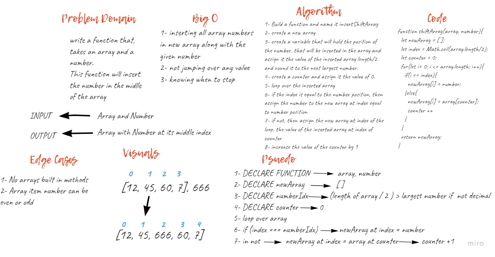

# Insert and shift an array in middle at index
Write a function called `insertShiftArray` which takes in an array and a value to be added. Without utilizing any of the built-in methods available to your language, return an array with the new value added at the middle index.  

## Whiteboard Process  
  

## Approach & Efficiency
1. I first took my time to understand the problem.
1. I solved the challenge on a text editor.
1. I started drawing the white-board.
1. It took me 1 and a half hour to complete the challenge.