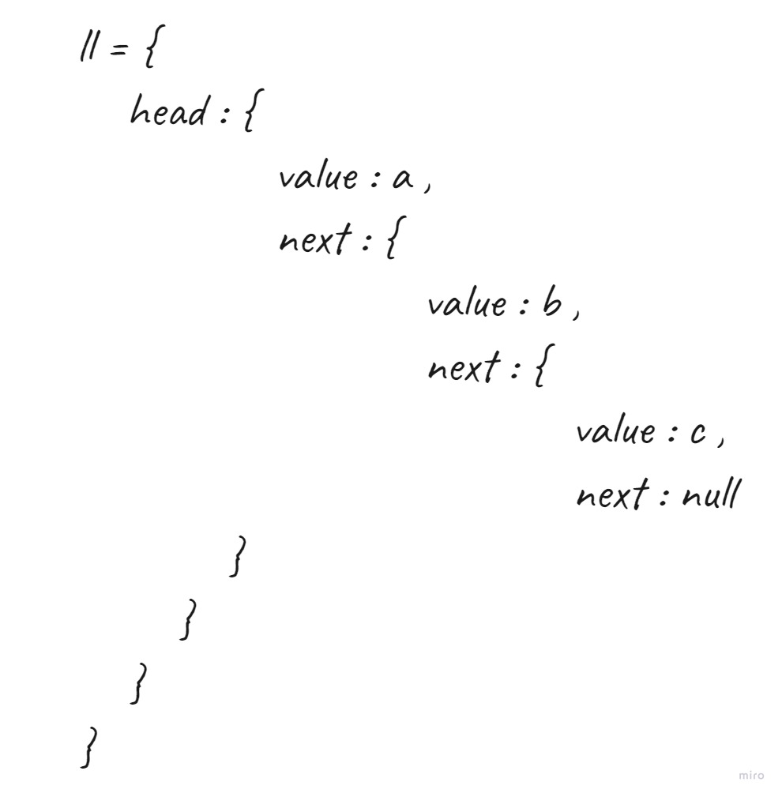

# linked-list  

## Challenge  
- create a `Node` class that has properties for the value stored in the Node, and a pointer to the next Node. 
- Create a `Linked List` class with the following properties:  
  - `insert` : Adds a new node with that value to the head of the list with an O(1) Time performance.
  - `includes` : checks if a value in the list exist
  - `toString` : returns all the nodes in a list in a `String` format.  
- add tests to the code to test for the following:
  1. Can successfully instantiate an empty linked list
  1. Can properly insert into the linked list
  1. The head property will properly point to the first node in the linked list
  1. Can properly insert multiple nodes into the linked list
  1. Will return true when finding a value within the linked list that exists
  1. Will return false when searching for a value in the linked list that does not exist
  1. Can properly return a collection of all the values that exist in the linked list

## Approach & Efficiency  

### Approach   
1. I understood the problem first
1. I imagined how the results should be
1. I made a drawings of how the `linked list` would be after insertion of multiple `nodes` 
  
1. I wrote the code
1. I made the tests   

### Efficiency
- Space :  
  - linkedList : O(n)
- Time :  
  - insert : O(1)
  - includes : O(n)
  - toString : O(n)
## API  

### How to Use
- To create an empty linked list : `const || let <name> = new LinkedList();`
- To insert a `Node` at the start of the linked list : `<name of linked list>.insert(<value>)`
- To check for values : `<name of linked list>.includes(<value>)` , it will return `true` if the `value` exist, otherwise it will return `false`.
- To output all of the values of the linked list : `<name of linked list>.toString()`

### Test

- `npm run test` 
- `npm run watch`
